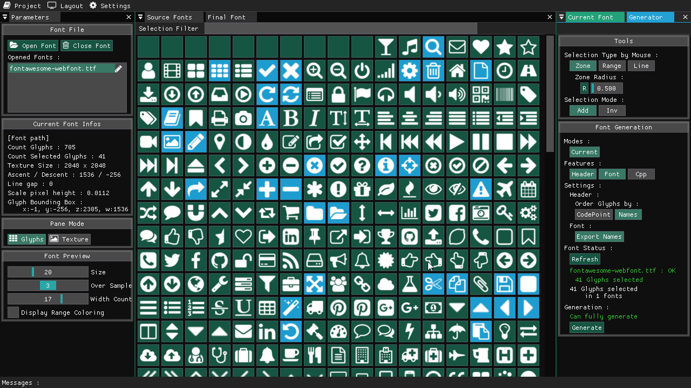
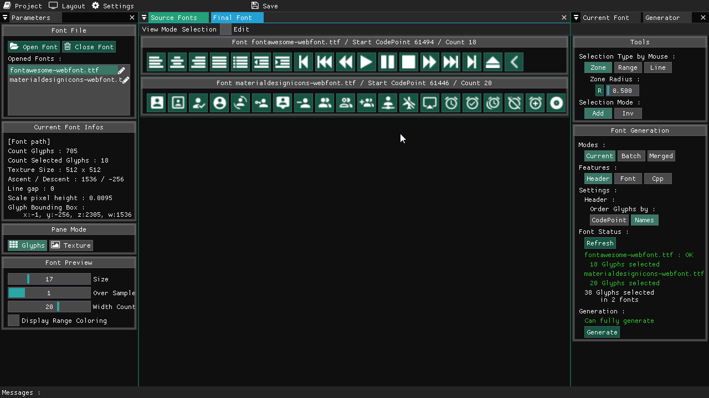
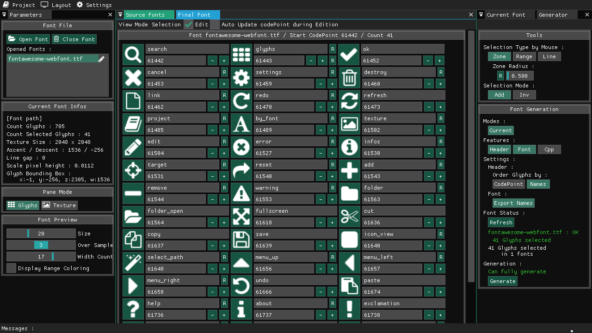
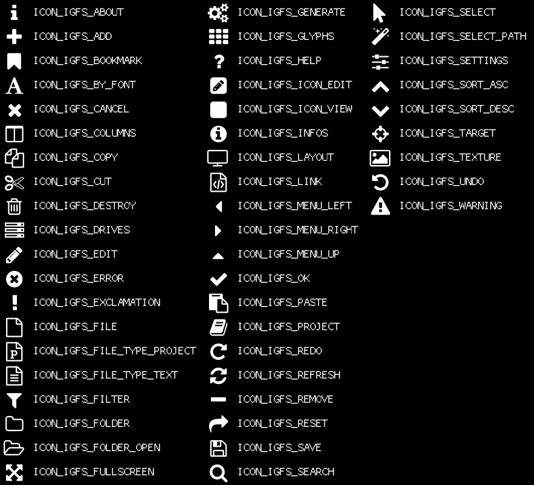

| Backend | Win | Linux | Osx |
| ------- | --- | ----- | --- |
| Opengl 3 | [](https://github.com/aiekick/ImGuiFontStudio/actions?query=workflow%3AWin) | [](https://github.com/aiekick/ImGuiFontStudio/actions?query=workflow%3ALinux) | [](https://github.com/aiekick/ImGuiFontStudio/actions?query=workflow%3AOsx) |
| Vulkan | [](https://github.com/aiekick/ImGuiFontStudio/actions?query=workflow%3AWin_Vulkan) | [](https://github.com/aiekick/ImGuiFontStudio/actions?query=workflow%3ALinux_Vulkan) | [](https://github.com/aiekick/ImGuiFontStudio/actions?query=workflow%3AOsx_Vulkan) |

Vulkan versions :
 * on windows its working fine, here, just not found a way for isntall Vulkan SDk with github action
 * on OSX, we must une Molten-Vk, and its not tested for now. if someone want to help :)


# [ImGuiFontStudio](https://github.com/aiekick/ImGuiFontStudio)

ImGuiFontStudio is a tool for Subset font and extract glyph names for use embbeded or not in a software, especially for use with ImGui for embedded way.

Greatly inspired / based on the project [IconFontCppHeaders](https://github.com/juliettef/IconFontCppHeaders)

This is my first big opensource software.

As a self learning man i always developped my softs in solo.

So maybe you will found some weird things, bad design pattern, 
bad optimization, or others bullshits :)

Please send me your feedback.
I enjoy all constructive comments and help is welcome.

Succesfully tested on my side :

* On Win 7 x64 (in version x86/x64 OpenGl3/Vulkan)
* On Linux Debian/Ubuntu (in version x64 OpenGl3/Vulkan)
* On Linux Debian/RaspberryOs (in version x86/x64 OpenGl3/Vulkan)
* MacOs Mojave (in exe version x86 OpenGl3)

## The features :

* can open ttf or otf font file
* can subset font file (one file same time or by batch)
* can translate or rescale glyphs
* can generate header with corresponding glyph names and codepoint
* can generate a card picture file who show the content (icon + name of the header)
* can generate src (C/C++/C#) file with compressed data for embedded (incorparated in binary) use
* can merge many font file in one (the glyphs will be resized)
* can edit codepoint and glyph names
* have a project file
* many tool available for select glyphs (by zone, by line, by codepoint range)
* Cross Platform, tested on Win/Osx/Linux 
* Change / define ImGui app Theme

For more information how to use the generated files, see this project : https://github.com/juliettef/IconFontCppHeaders

My soft do the same job and more but easier for user :)

## How to Build :

You need to use cMake.
For the 3 Os (Win, Linux, MacOs), the cMake usage is exactly the same, 

1) Choose a build directory. (called here my_build_directory for instance) and
2) Choose a Build Mode : "Release" / "MinSizeRel" / "RelWithDebInfo" / "Debug" (called here BuildMode for instance)
3) Run cMake in console : (the first for generate cmake build files, the second for build the binary)
```cpp
cmake -B my_build_directory -DCMAKE_BUILD_TYPE=BuildMode
cmake --build my_build_directory --config BuildMode
```

Some cMake version need Build mode define via the directive CMAKE_BUILD_TYPE or via --Config when we launch the build. 
This is why i put the boths possibilities

By the way you need before, to make sure, you have needed dependencies.

### On Windows :

You need to have the opengl library installed

### On Linux :

You need many lib : (X11, xrandr, xinerama, xcursor, mesa)

If you are on debian you can run :  

```cpp
sudo apt-get update 
sudo apt-get install libgl1-mesa-dev libx11-dev libxi-dev libxrandr-dev libxinerama-dev libxcursor-dev
```

### On MacOs :

you need many lib : opengl and cocoa framework

## How to use generated font 

ImGuiFontStudio will generate, 4 file types, depending of your needs.

 | File Type | Description |
 | --------- | ----------- |
 | Font file TTF | Vector Font File needed for external mode |
 | Source Code | .c/.cpp/.cs for c/c++/c# with conpressed font data for embedded mode |
 | Header code | .h/.cs for c/c++/c# with infos like (glyph labels/codepoint min/max ranges)]
 | Card | .png this card is a picture file who show each glyph and the corresponding labels|
 
 1) If you want to have no external dependencie, 
the embedded mode is for you, but your binary file can have a bigger size if you have a big font.
 2) If you want to have a external font file and more compact binary file, the external mode is for you.
 
For loading that in ImGui, you need to merge the font icon into the current main font used in your ImGui App.
But we just need to load some codepoints, not all the unicode table.
This is why you have in the header file the min/max range infos.

## External Font File Use :

for instance here in this example for load embedded font, we have (with font Prefix IGFS) :
* ICON_MIN_IGFS => min range
* ICON_MAX_IGFS => max range
* FONT_ICON_FILE_NAME_IGFS => the font file name to load (ex: fontawesome.ttf)

### For C (CImGui)

```c
ImGuiIO* ioptr = igGetIO();
ImFontAtlas_AddFontDefault(ioptr->Fonts, NULL);
const ImWchar icons_ranges[3] = { ICON_MIN_IGFS, ICON_MAX_IGFS, 0 };
ImFontConfig* icons_config = ImFontConfig_ImFontConfig();
icons_config->MergeMode = true; 
icons_config->PixelSnapH = true;
ImFontAtlas_AddFontFromFileTTF(ioptr->Fonts, FONT_ICON_FILE_NAME_IGFS, 15.0f, icons_config, icons_ranges);
ImFontConfig_destroy(icons_config);
```

### For C++

```cpp
ImGui::GetIO().Fonts->AddFontDefault();
static const ImWchar icons_ranges[] = { ICON_MIN_IGFS, ICON_MAX_IGFS, 0 };
ImFontConfig icons_config; icons_config.MergeMode = true; icons_config.PixelSnapH = true;
ImGui::GetIO().Fonts->AddFontFromFileTTF(FONT_ICON_FILE_NAME_IGFS, 15.0f, &icons_config, icons_ranges);
```

### For C# (ImGui.NET)

```cpp
ImGui.GetIO().Fonts.AddFontDefault();
unsafe
{
	ImFontConfigPtr config = ImGuiNative.ImFontConfig_ImFontConfig(); config.MergeMode = true; config.PixelSnapH = true;
	GCHandle rangeHandle = GCHandle.Alloc(new ushort[]{IconFonts.IGFS_Labels.ICON_MIN, IconFonts.IGFS_Labels.ICON_MAX,0}, GCHandleType.Pinned);
	ImGui.GetIO().Fonts.AddFontFromFileTTF(IconFonts.IGFS_Labels.FONT_ICON_FILE_NAME, 15, config, rangeHandle.AddrOfPinnedObject());
}
```

## Embedded Font File Use :

for instance here in this example for load embedded font, we have (with font Prefxi IGFS) :
* ICON_MIN_IGFS => min range
* ICON_MAX_IGFS => max range
* FONT_ICON_BUFFER_NAME_IGFS => the compressed buffer name you have in your_embedded_font.cpp to load 
(ex: IGFS_compressed_data_base85)

### For C (CImGui)

```c
ImGuiIO* ioptr = igGetIO();
ImFontAtlas_AddFontDefault(ioptr->Fonts, NULL);
const ImWchar icons_ranges[3] = { ICON_MIN_IGFS, ICON_MAX_IGFS, 0 };
ImFontConfig* icons_config = ImFontConfig_ImFontConfig();
icons_config->MergeMode = true; 
icons_config->PixelSnapH = true;
ImFontAtlas_AddFontFromMemoryCompressedBase85TTF(ioptr->Fonts, FONT_ICON_FILE_NAME_IGFS, 15.0f, icons_config, icons_ranges);
ImFontConfig_destroy(icons_config);
```

### For C++

```cpp
ImGui::GetIO().Fonts->AddFontDefault();
static const ImWchar icons_ranges[] = { ICON_MIN_IGFS, ICON_MAX_IGFS, 0 };
ImFontConfig icons_config; icons_config.MergeMode = true; icons_config.PixelSnapH = true;
ImGui::GetIO().Fonts->AddFontFromMemoryCompressedBase85TTF(FONT_ICON_BUFFER_NAME_IGFS, 15.0f, &icons_config, icons_ranges);
```

### For C# (ImGui.NET)

```cpp
ImGui.GetIO().Fonts.AddFontDefault();
unsafe
{
	ImFontConfigPtr config = ImGuiNative.ImFontConfig_ImFontConfig(); config.MergeMode = true; config.PixelSnapH = true;
	GCHandle rangeHandle = GCHandle.Alloc(new ushort[]{IconFonts.IGFS_Labels.ICON_MIN, IconFonts.IGFS_Labels.ICON_MAX,0}, GCHandleType.Pinned);
	ImGui.GetIO().Fonts.AddFontFromMemoryCompressedBase85TTF(IconFonts.IGFS_Bytes.compressed_data_base85, 15, config, rangeHandle.AddrOfPinnedObject());
}
```

## Boths cases :

In both cases, the use in code is the same :

After that step, when you have a ImGui widget to test, you just need to put in the label field,
the glyph you want, defined in the header file for labels :

### For C/C++

```cpp
ImGui::Button(ICON_IGFS_FOLDER_OPEN " Open Font");
```

### For C# (ImGui.NET)

```cpp
ImGui::Button(IconFonts.IGFS_Labels.FOLDER_OPEN + " Open Font");
```

and you will have this result : 


## Contributions / Issues / Features request

You can use the issue tab for report issues or for features request.
Or you can also contribute with discuss via issues tabs, or/and Pull Requests :)

## License :

ImGuiFontStudio is an open source software under [license apache 2.0](LICENSE)

## Library used :

* [Glfw - ZLIB](http://www.glfw.org/)
* [Dear ImGui - Docking branch - MIT](https://github.com/ocornut/imgui)
* [Glad - MIT](https://github.com/Dav1dde/glad)
* [Stb - MIT](https://github.com/nothings/stb)
* [tinyxml2 - ZLIB]( https://github.com/leethomason/tinyxml2)
* [dirent - MIT]( https://github.com/tronkko/dirent)
* [sfntly - Apache 2.0](https://github.com/rillig/sfntly)
* [cTools - MIT](https://github.com/aiekick/cTools)
* [ImGuiFileDialog - MIT](https://github.com/aiekick/ImGuiFileDialog)

## Screenshots (with the default theme)

Main View : Source pane


Main View : Final pane with two fonts


Main View : Final pane for edition


Sample of a Card :


## Projects who are using this font tool :

Let me know your project wiht a pciture and i can add it here :

For the moment (as i know), there is :

[ImGuiFontStudio](https://github.com/aiekick/ImGuiFontStudio) himself :)

[ImGuiFileDialog](https://github.com/aiekick/ImGuiFileDialog)
